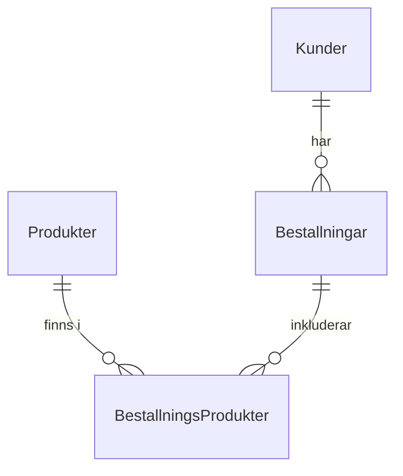

# Huvudrubrik

Lorem ipsum dolor amit..Lorem ipsum dolor amit..Lorem ipsum dolor amit..Lorem ipsum dolor amit..Lorem ipsum dolor amit..Lorem ipsum dolor amit..Lorem ipsum dolor amit..Lorem ipsum dolor amit..

Stycke två, två två vååå två vååå två vååå två vååå två vååå två vååå två vååå två vååå två vååå två vååå två vååå.

## Underrubrik

Stycke två, två två vååå två vååå två vååå två vååå två vååå två vååå två vååå två vååå två vååå två vååå två vååå.

Fin kod:

```sql
SELECT * FROM UNDERRUBRIK
```

```python
for x in [1, 2, 3]:
    print(x)
```

Man kan även skriva inline-kod, som t.ex. `SELECT * FROM BLAHA`.


